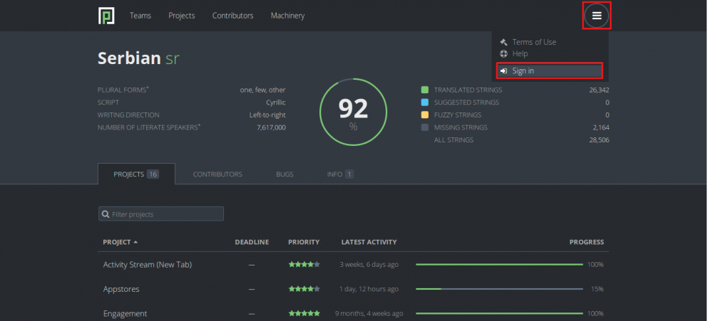
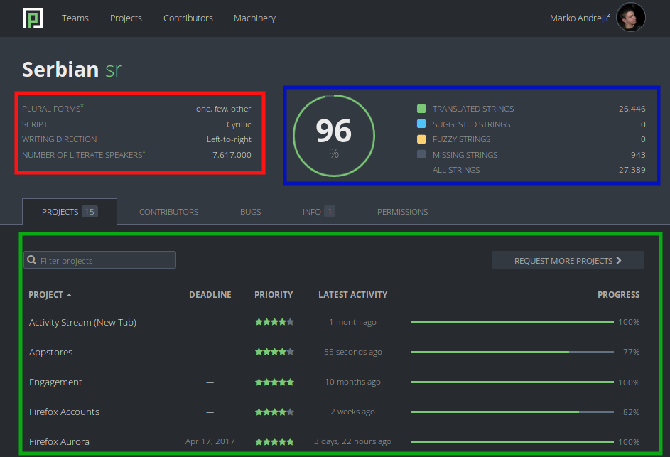

# Style Guide Serbian (sr)

## Увод

Овај водич је намењен свим новим, а и старијим члановима Mozilla Србија заједнице, који желе да се прикључе тиму локализације ове заједнице, ради олакшања превођења. Водич садржи упутства о прављењу налога на Pontoon платформи за превођење, начину на који се преводе одређене речи, правопису и другим стварима везаним за локализацију Mozilla производа.

## Pontoon

Локализација Mozilla производа се врши преко платформе Pontoon. На њој се налазе сви производи који су јавно доступни корисницима, Firefox, Firefox за Android, Thunderbird, Mozilla.org, итд.

### Прављење налога

Како бисте започели са локализацијом, неопходно је прво да направите налог на Pontoon сајту који уједино можете користити и као Firefox налог.

Кликните на мени иконицу у горњем десном углу, а затим кликните на “Sign in” поље.

Затим ћете бити упућени на страницу за прављење Firefox налога.

Унесите потребне податке и након што завршите са прављењем налога и потврђивањем истог путем верификационе е-поште коју добијете, можете приступити сајту Pontoon.

Након свега овога, спремни сте за локализацију!

### Превођење

Отворите Pontoon страницу српске заједнице.

На страници нашег језика се налазе готово све информације о пројектима које преводимо. Општи подаци о језику су означени црвеном бојом, статистике локала и пројеката су означене плавом бојом, а листа пројеката је означена зеленом бојом.

Сада изаберите пројекат који желите да преводите, или који вам је доделио лидер тима локализације.

На левој страни се налази листа речи/реченица целог пројекта (и преведене и непреведене). На десној страни се налази поље за превођење, историја превода изабране речи/реченице, како је преведено на другим језицима и сличне информације. Када унесете превод у бело поље, притисните на дугме “Suggest” (на слици стоји дугме “Save” зато што тај члан има виши чин на овој платформи, који му омогућава да одмах преводи, без чекања да неко одобри његов превод). Ваш предлог ће бити сачуван и послат на преглед. Сачекајте да неко од ревизора локала прегледа ваш превод. У међувремену можете наставити са даљим превођењем пројекта.

## Правопис

### Писмо

Писмо које се користи за превођење Mozilla-них пројеката је ћирилица. Постоје и изузеци када се речи не преводе, већ остају у изворном облик (имена брендова, стручних скраћеница и сл.).

### Обраћање кориснику

Када преводите реченицу којом се Firefox (тј. ви) обраћа/те кориснику, преводите у форми персирања кориснику, тј. користите “ви”, “вама”, “ваше” и слично, али са малим словом (великим само у случају да реченица почиње том речју). На овај начин добијамо превод у којем не морамо да бринемо о роду корисника.

Постоји још једна ствар код обраћања корисника, а то је да се енглеско Please wait, преводи као Сачекајте, уместо Молимо вас, сачекајте.

### Имена

Имена брендова, програма, компанија (нpr. Firefox, Android, Gmail, итд.) се не преводе, већ се остављају на оригиналном (најчешће енглеском) језику. Дакле Firefox је Firefox, a не Фајерфокс. Када се име мења по падежима, онда се користи знак цртице “-” заједно са одговарајућим словом (нпр. “Проверите подешавања вашег Firefox-а”)

### Велико слово

У српском правопису, великим словом се пишу почетне речи у реченици, лична имена и презимена, надимци и атрибути, имена градова, река, планина и слично. Када се ради о превођењу Mozilla-них производа, сва ова правила се и ту примењују. Такође је потребно избегавати писати великим словом одређене енглеске речи које су писане великим словом. Пример: User Interface се пише као кориснички интерфејс. Слово к ће бити велико само у случају да реченица почиње том речју.

### Скраћенице

Стручни термини и изрази, имена страних организација и брендова, који су написани у скраћеном облику, тј. као скраћеница, се не преводе и остају на оригиналном језику (нпр. HTTP, HTTPS, SEO, API…).

## О водичу

Овом водичу су допринели чланови наше заједнице Марко Андрејић и Марко Костић уз подршку волонтера из других глобалних Mozilla заједница.

Водич је урађен по узору на водич “Гномов правопис и језик превода (2011)”.

Овај водич је издат под Creative Commons Attribution-ShareAlike 4.0 International (CC BY-SA 4.0) лиценцом. Више о овој лиценци, можете прочитати [овде](https://creativecommons.org/licenses/by-sa/4.0/legalcode)
