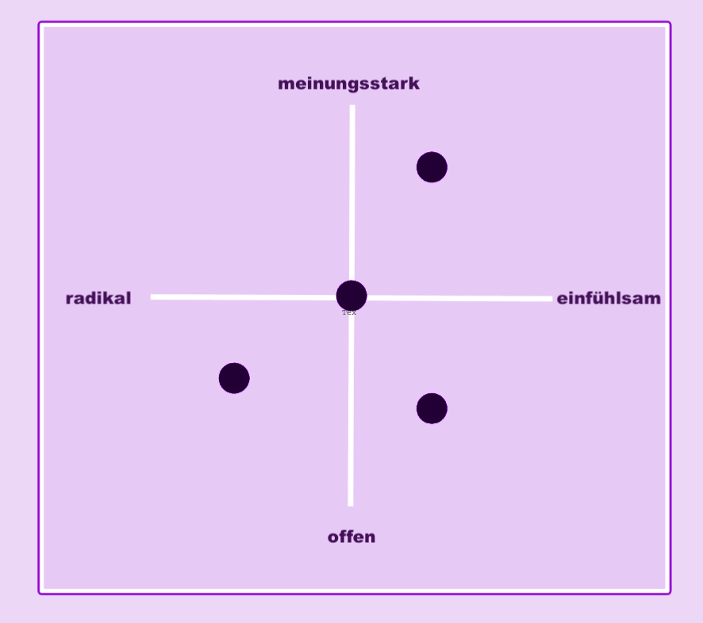

# How to Firefox in German

Dieses Dokument soll die Erstellung und Lokalisierung von Texten erleichtern – für optimal aufbereitete und konsistente Inhalte. Wichtig hierfür sind:

* [Persönlichkeit & Tonalität](#pers%C3%B6nlichkeit--tonalit%C3%A4t)
* [Glossar](#glossar)

Das Dokument spiegelt den aktuellen Stand wieder. Unsere Marke entwickelt sich aber immer weiter, sodass Aktualisierungen weiterhin vorgenommen werden.

## Warum ist dieser Guide wichtig für die Lokalisierung unserer Texte?

Unsere Texte sollen nicht nur eins zu eins übersetzt werden, sondern unsere Markenpersönlichkeit und Tonalität widerspiegeln und für den kulturellen und linguistischen Hintergrund optimiert werden. Die emotionale Intention des Ausgangstextes soll adaptiert werden.

Unsere [Markeneigenschaften](#unsere-markeneigenschaftenfirefox-brand-personality) bestimmen dabei die Tonalität der englischen als auch deutschen Fassung. Dieser Guide soll dabei helfen, Firefox als Marke besser zu verstehen, um ein besseres Gefühl dafür zu bekommen, wie die Texte in der deutschen Sprache klingen sollen. Außerdem teilen wir hier festgelegte, unternehmensspezifische Schreibweisen, die den Lokalisierungsprozess erleichtern sollen.

## About Firefox – wer wir sind

Firefox ist mehr als nur der Browser. Firefox ist bietet ein ganze Reihe an Produkten, die Menschen dabei helfen sollen, online sicherer zu sein.

Firefox ist eine Challenger-Brand, die als Herausforderer den Status quo infrage stellt und sich für die Online-Rechte der Nutzer stark macht.

Bei allem was wir tun, stellen wir die Rechte und Bedürfnisse der Menschen, die unsere Produkte nutzen, an die erste Stelle. Und als Tech-Unternehmen stellen wir Menschen immer über Profit.

Firefox als Marke vereint den Firefox Ethos und die sich erweiternde Bandbreite der Produkte. (Mozilla ist dabei die Non-Profit-Organisation, die hinter Firefox steht.)

**Brand promise:**

Firefox fights for you

  (Wichtig: Dieser Claim wird nie ins Deutsche übersetzt. Wir benutzen ihn in der deutschen Kommunikation ebenfalls auf englisch)

**Wofür kämpfen wir:**

Firefox kämpft für seine Nutzer/innen – mit Produkten, die Menschen auch online die Kontrolle über Leben geben.

**Firefox Produkte:**
* Firefox Browser (Desktop-Browser)
* Firefox Mobile (für iOS und Android)
* [Firefox Send](https://send.firefox.com/) (versendet Dateien bis zu 2.5 GB per verschlüsseltem Link, der automatisch abläuft)
* [Firefox Monitor](https://monitor.firefox.com/) (überprüft E-Mail-Adressen auf Datenleaks)
* [Firefox Lockwise](https://lockwise.firefox.com/) (Passwort-Manager)
* [Pocket](https://play.google.com/store/apps/details?id=com.ideashower.readitlater.pro&hl=de) (Qualitätsinhalte aus dem Web)
* [Firefox Reality](https://mixedreality.mozilla.org/firefox-reality/) (VR Browser)

## Persönlichkeit & Tonalität

### Mit wem sprechen wir?

Wir beschreiben unsere Zielgruppe als Conscious Choosers. Damit sind Menschen gemeint, die bewusste Entscheidungen treffen oder treffen wollen – online und offline.

Conscious Choosers:
* entwickeln Vorlieben und Konsumentscheidungen sorgsam und bewusst
* streben danach, Handlungen mit ihren Werten und Idealen in Einklang zu bringen
* sind anspruchsvolle Kunden
* recherchieren oft selbst, um alle Optionen zu kennen und zu verstehen

### Unsere Markeneigenschaften/Firefox Brand Personality

|Eigenschaften |Persönlichkeit |
| -------| ---------|
|opinionated/meinungsstark | **Firefox handelt aus Überzeugung und nimmt selbstbewusst klare Positionen ein.**  Unsere Produkte zeigen, dass sich unsere Motivation aus unserer Brand-Vision ableitet. Unser Brand-Ethos liegt allem, was wir tun, zugrunde. Und das wollen wir auch an unsere Nutzern und Partner kommunizieren.  |
|open/offen |**Firefox findet, dass das Internet für alle zugänglich und sicher sein sollte und strebt immer ein offenes Gespräch oder eine Zusammenarbeit an.**  Open-minded. Open-hearted. Open source. Eine globale Perspektive ist fester Bestandteil unserer Marke. Wir sprechen viele Sprachen und bemühen uns darum verschiedene Blickwinkel einzunehmen. |
|kind/einfühlsam|**Firefox antizipiert Bedürfnisse und bietet dort Lösungen und Alternativen an, wo Freiheit und Rechte der Menschen, die das Web nutzen, bedroht sind oder missbraucht werden können.**  Wir wollen das Beste für unsere Nutzer und die Welt. Also gehen wir mit gutem Beispiel voraus: wir entwickeln bessere Produkte, wir starten Dialoge, wir arbeiten offen und mit anderen zusammen, wir bilden uns und andere weiter und wir informieren unsere Nutzer. Dabei handeln wir allen Menschen gegenüber empathisch. |
|radical/radikal|**Firefox stellt den Status quo und gängige Praktiken der Tech-Giganten infrage und kämpft mit Zuversicht für ein besseres Internet.**  Optimistisch in die Zukunft des Internets zu schauen, ist ein radikaler Akt. Die Bedürfnisse der Nutzer vor unsere eigenen zu stellen ist ebenso radikal. Wir rütteln am Status quo, weil wir finden, dass es richtig ist. |

Unsere Marken- Persönlichkeit wird von dem Zusammenspiel dieser Eigenschaften definiert. Je nach Kontext kann eine Eigenschaft deutlicher oder weniger deutlich hervorstechen.

### Ansprache/Tonalität

Unsere Sprache ist:

|Ansprache|Tonalität|
|-----|----|
|**Direkt, deutlich, einfach verständlich**|Wir wollen, dass sich die Menschen, mit den wir sprechen, willkommen fühlen und benutzen Wörter und Konzepte, die jeder versteht.|
|**prägnant**|Wir mögen kurze Headlines, Sätze und eindeutige Call-to-Actions. Wichtige Keyword holen wir nach vorn.  Komplizierte Satzkonstruktionen oder Sätze ohne Mehrwert versuchen wir zu vermeiden. |
|**authentisch**|Unsere Texte sind – wie unsere Produkte – von Menschen für Menschen gemacht. Wir sprechen mit den Leuten, die Firefox nutzen, auf Augenhöhe und benutzen eine natürliche Sprache. Wir wissen wovon wir reden, aber wir tun auch nicht so als wüssten wir immer alles.|
|**natürlich**|Passivsätze nur sparsam verwenden und lieber in Aktivform schreiben. Nominalstil vermeiden. Lieber zwei kurze Sätze als einen langen.|
|**respektvoll**|Ohne zu formal zu klingen|
|**humorvoll**|Ohne zu flapsig oder cheesy  zu werden|
|**inklusiv**|Wir achten auch beim Schreiben darauf, niemanden auszuschließen und wir versuchen Annahmen über die Personen, die unsere Texte lesen, zu vermeiden.  Das heißt, wir vermeiden das generische Maskulinum und Formen, die lediglich 2 Geschlechter einbeziehen ( Doppelform, Schrägstrich usw.).   [Gendersternchen](https://de.wikipedia.org/wiki/Gendersternchen) und [Gendergap](https://de.wikipedia.org/wiki/Gendergap_(Linguistik)) sind zwar inklusiver, aber eben auch länger. Durch Neutralisierungen und direkte Ansprachen lässt es sich oft leichter vermeiden, Geschlechtergruppen auszuschließen. Gleichzeitig ist es leichter die vorgegebene Zeichenanzahl nicht zu überschreiten.   Auch wenn die meisten Leute, die Firefox anspricht, recht Tech-affin sind, erklären wir Begriffe, die unter Umständen nicht eindeutig sind etwas genauer.   Wir schreiben mit dem Verständnis dafür, dass wir mit Menschen auf der ganzen Welt – mit unterschiedlichen Lebensumständen, Backgrounds und Erfahrungen – sprechen. |
|**relevant**|Lesende sollen auf den ersten Blick erkennen können, was sie von dem Text/Inhalt erwarten können und in der Lage sein einen persönlichen Bezug zu sehen. Wir holen die Menschen dort ab, wo er gerade ist. Kulturelle Anspielungen müssen Sinn machen und zum Markt passen.|
|**Optimistisch und motivierend**|Wir glauben an eine gute Zukunft für das Internet. Wir sprechen zwar über das, was nicht so gut läuft, aber wir enden immer mit einem positiven Ausblick.|
|**Kreativ**|Auch wenn Information und Klarheit an erster Stelle stehen, zeigen wir uns gern auch sprachlich innovativ. Wir wollen niemals langweilig klingen und versuchen Marketing-Klischées zu vermeiden.|

### DU vs. SIE

**Firefox**

Ganz im Sinne des Community-Gedankens verwenden wir “du”. Das ist unkomplizierter, emotionaler und aktivierender.

“Du” wird dabei – außer natürlich am Satzanfang –  **klein** geschrieben.

### Tipps für SEO-Texte

* Auch SEO-Texte sollen nicht eins zu eins übersetzt, sondern so lokalisiert werden, dass sie einen Mehrwert für den Leser schaffen und kulturell relevant sind.
* Titel sollten so spezifisch wie möglich formuliert werden und nicht das Übergeordnete Thema, sondern immer das konkrete Thema beschreiben (Bsp.: geht es um digitale Privatsphäre, sollte im Titel nicht stehen: Alles, was du über Privatsphäre wissen musst.

### Tipps für Blog-Artikel

* Auch hier sollte der Titel so eindeutig wie möglich sein
* Die ersten 1-2 Sätze werden beim Einbau als Teaser übernommen. Hier sollte der Leser bestenfalls schon erkennen, was im Text etwa abgedeckt wird bzw. Lust bekommen weiterzulesen. (Teaser werden so angezeigt: https://blog.mozilla.org/firefox/de/)
* Zwischenüberschriften

Beispiel-Posts:
* https://blog.mozilla.org/firefox/de/firefox-versprechen-fuer-deine-persoenlichen-daten/
* https://blog.mozilla.org/firefox/de/so-schuetzt-du-deine-daten-auf-reisen/
* https://blog.mozilla.org/firefox/de/join-firefox/
* https://blog.mozilla.org/firefox/de/loesche-deinen-digitalen-fingerabdruck-in-firefox/
* https://blog.mozilla.org/firefox/de/so-blockierst-du-krypto-mining-auf-deinem-computer-mit-firefox/
* https://blog.mozilla.org/firefox/de/add-ons-fuer-digitalen-fruehjahrsputz/
* https://blog.mozilla.org/firefox/de/online-tracking-hol-dir-die-kontrolle-zurueck/
* https://blog.mozilla.org/firefox/de/firefox-fights-for-you/
* https://blog.mozilla.org/internetcitizen/de/2018/10/29/sichere-zuallererst-deine-passwoerter/
* https://blog.mozilla.org/firefox/de/das-original-unter-den-alternativen-firefox/
* https://blog.mozilla.org/firefox/de/firefox-monitor-dein-schutz-vor-hackern/

## Glossar

### Immer wiederkehrende Schreibweisen bei Firefox Englisch-Deutsch

Die hier aufgeführten Begriffe werden häufig in unserer Kommunikation verwendet. Und sollten aus Konsistenzgründen bevorzugt eingesetzt werden.

Bei Unsicherheiten kann auch die [Transvision Suche](https://transvision.mozfr.org/?recherche=search+choice&repo=mozilla_org&sourcelocale=en-US&locale=de&search_type=strings) konsultiert werden. Da in der Suche aber häufig auch ältere Übersetzungs-Versionen in der Ergebnisliste (oft noch mit der formalen Ansprache) angezeigt werden, dient dieses Tools eher als Orientierungshilfe.

### Folgende Begriffe und Schreibweisen gelten jedoch immer:

|English Term|Translation|
|-----|-----|
|Activity Stream|Activity Stream|
|Add-ons Extensions|Add-ons Erweiterungen [Mehr darüber](https://wiki.mozilla.org/Add-ons/Terminology)|
|Ad tracker|Werbe-Tracker|
|Adblocker|Adblocker|
|Auto-fill Form|Autovervollständigung|
|Block fingerprinting|Fingerprinter (Identifizierer) blockieren|
|Browser Engine|die Browser Engine, CSS Engine …|
|Browser history|Chronik|
|Clickbait|Clickbait, Klickköder, Clickbaiting|
|to champion|für + Eigenschaft dafür eintreten|
|Console|Konsole|
|Context Graph|Context Graph oder Empfehlungssystem|
|Control Tab|Control Tab|
|Corporate control|Kontrolle durch Unternehmen|
|Corporate Powers|Technologie-Giganten / Tech-Konzerne / Tech-Riesen|
|Customizable search defaults|Sucheinstellungen anpassen|
|Cryptominer  Cryptomining|Krypto-Miner Krypto-Mining|
|data breach|Datenleck|
|Debugger|Debugger|
|Decentralized Internet|dezentralisiertes Internet|
|Decentralization|Dezentralisierung|
|Deep Learning|Deep Learning|
|Digital Citizenship|digitale Staatsbürgerschaft|
|Digital Inclusion|Digitale Teilhabe|
|Desktop Browser|Desktop-Browser, für den Desktop|
|Dev Tools|Dev Tools|
|Download Firefox|Firefox downloaden, für CTA-Buttons auch: Download Firefox|
|Dropdown menu|Menüschaltfläche|
|Feature|Funktion, Features|
|Firefox Privacy|Datenschutz bei Firefox|
|Icon|Symbol|
|Inspector|Inspector|
|intelligent search suggestions|intelligente Suchvorschläge|
|Internet health|Zustand des Internets|
|Internet experience|Surf-Erlebnis|
|JavaScript-Debugger|JavaScript-Debugger|
|Join Firefox|Join Firefox Komm zu Firefox (nicht auf CTA buttons nutzen, dort wird zwischen Sign in (einloggen) und Sign up (Anmelden oder Konto erstellen) differenziert. |
|lean browser|schlanker Browser, auf das Wesentliche reduzierter Browser|
|Lean Data Toolkit|Lean Data Toolkit|
|Library|Bibliothek|
|limited data|verbleibende Daten|
|local community|näheres Umfeld / Umfeld vor Ort|
|Memory|Speicher|
|Mozillian|Mozillianer|
|Mozilla Developer Network|Mozilla Developer Network|
|Multi-process|Multi-Prozess-Architektur|
|Network|Netzwerk|
|Network requests|Netzwerkanfragen|
|New tab|Neuer Tab|
|Night mode|Nachtmodus|
|Non-Profit|Bevorzugt: Non-Profit Non-Profit-Organisation  Weniger bevorzugt ;-):  gemeinnützig|
|Open Source|Open Source Aber: Open-Source-Initiative|
|Padding|Innenabstand|
|Performance|Performance, Leistung|
|performance panel|Ansicht für die Laufzeitanalyse|
|Personal Data Promise: Take less. Keep it safe. No secrets. |Unser Versprechen für deine (persönlichen) Daten Oder auch (Das) Firefox Versprechen für deine (persönlichen) Daten:  Wenig sammeln. Sicher aufbewahren. Ehrlich sein. |
|Privacy|Datenschutz – die Mittel zum Schutz Privatsphäre – das Ergebnis  Der Unterschied: Datenschutz schützt unsere Privatsphäre.|
|Privacy Mode|Privater Modus|
|Policy|Richtlinie Politik-Gestaltungsprozesse|
|rebuilt from the ground|fundamental erneuert|
|Responsive Design Mode|Responsive Design Mode|
|Scratchpad|Scratchpad|
|seamlessly|nahtlos / geräteübergreifend|
|Search Choice|Bevorzugte Suchauswahl|
|Search Engine|Suchmaschine|
|Search engine options|Anpassbare Sucheinstellungen|
|Smarter Sharing|Smarter teilen|
|Storage Panel|Storage Panel|
|Style Editor|Style Editor|
|tab hop|Tabs wechseln|
|Third-party advertisers|Werbung von Drittanbietern|
|Technology|Web-Technologien Technik digitale Technologien|
|technology devices|technische Geräte|
|Top Sites (new tab)|Wichtige Seiten (in neuer Tab)|
|Toolbar|Symbolleiste|
|trust and privacy|Daten- und Vertrauensschutz|
|User|User|
|Volunteer|Mitmachen|
|Web Audio|Web Audio|
|Webcam-Cover|Webcam-Abdeckung|
|Web-Innovations|Web-Innovationen|
|Web Literacy|Web-Kenntnisse|

### Unternehmensspezifische Schreibweisen/Firefox Claims:

|Content type|Spelling|
|----|----|
|Unternehmensname // Company name|Der Markenname wird aus Alleinstellungsgründen nie per Bindestrich angebunden.  Beispiel: Firefox Team statt ~~Firefox-Team~~  Einzige Ausnahmen: Firefox-Konto und Firefox-Produkte  Gleiches gilt für Mozilla: Mozilla Team statt ~~Mozilla-Team~~  Außerdem wird Mozilla Im Fließtext stets so ausgeschrieben. Nicht erlaubt ~~moz://a~~|
|Claims // Taglines für Firefox|[Firefox fights for you](https://www.mozilla.org/de/firefox/fights-for-you/) (Achtung: wird nicht übersetzt, sondern bleibt Englisch)  Weniger Big-Tech, mehr Good-Tech   Wir kämpfen für ein besseres Internet – mit Produkten, die Dir auch online die Kontrolle über Dein Leben geben.  Firefox respektiert Deine Privatsphäre und macht es Dir leicht, Deine Daten zu schützen.   Du entscheidest, was Du teilst und wann.  Deine Daten gehören Dir. Wir verkaufen sie niemals.  Für Menschen, statt für Profit.   Tech mit Respekt  Komm zu Firefox  Alle reden über Privatsphäre. Firefox macht Privatsphäre. Mit jedem einzelnen Produkt.  Firefox kann mehr als nur einen richtig guten Bowser.  Zeige Big-Tech, dass du dich nicht zum Produkt machen lässt.  Nutze Technologien, die sich für dich einsetzen.  Privatsphäre in jedem Produkt. Nicht nur in der Tagline.  Das Firefox Versprechen für deine persönlichen Daten: Wenig sammeln. Sicher aufbewahren. Ehrlich sein.|
|Website und Blog-URL’s|Für einen verbesserten Lesefluss entfällt im Fließtext entfällt das www  Beispiel: mozilla.org  Entsprechend entfällt bei Blogs oder beispielsweise dem MDN das https:// im Fließtext.  Beispiel: blog.mozilla.org/ und developer.mozilla.org/de/|
|Social Media URL’s|**Firefox** https://twitter.com/firefox_de https://www.facebook.com/Firefox https://www.youtube.com/user/firefoxchannel  **Mozilla** https://twitter.com/mozilla https://www.facebook.com/mozilla https://www.instagram.com/mozillagram  In der Kommunikation werden hier idealerweise jeweils das entsprechende Icon für den jeweiligen Kanal samt Handle kommuniziert.|
|Fremdmarken // Third party brands|Die Schreibweise von Fremdmarken wird jeweils 1:1 von der jeweiligen Marke übernommen.  Beispiel: Vidyo|
|Anglizismen // English Words in German|Es können Anglizismen verwendet werden. Als Grundregel gilt hier: Die Ausdrücke sollten geläufig und allgemeinverständlich sein. Ansonsten sollten sie weiter ausgeführt werden. Oder durch einen gleichbedeutenden deutschen Ausdruck ersetzt werden.  Englisch-Deutsche Wortkombinationen werden mit Bindestrichen angebunden. Beispiel: Open-Source-Initiative|
|Metaphern und Sprichwörter //Metaphors and sayings|1:1 Übersetzung nur wenn möglich. Ansonsten durch eine in die gleiche Richtung gehende Umschreibung.|

### Allgemeine Schreibweisen

|&nbsp;| &nbsp;|
|----|----|
|Datum // Dates| Numerisch: TT.MM.JJJJ – 06.03.2017 Im Fließtext: 6. März 2017, eine vorangestellte Null kann eingefügt werden.  Beispiel: 06.03.|
|Uhrzeiten // Time|Uhrzeiten werden mit einer ein- oder zweistelligen Ziffer geschrieben, durch einen Punkt getrennt und mit “Uhr” beendet.  Beispiel: 16.00 Uhr|
|Zahlen  // Numbers|Zahlen bis zwölf werden im Fließtext immer ausgeschrieben.  Zahlen-Wortkombinationen richten sich nach dem Duden.  Tausenderstellen werden mit Punkten getrennt, das Komma ist das Dezimaltrennzeichen|
|Bindestriche // Hyphens|Bei Zahl-Wort-Kombinationen: 80-prozentig  Deutsch-Englisch-Kombinationen: Non-Profit-Organisation  Für bessere Lesbarkeit: Desktop-Browser|
|Gedankenstriche|Option + Bindestrich = Gedankenstrich (- vs. –)|
|Ausrufezeichen // Exclamation marks|Sehr sparsam einsetzen.|
|Prozentangaben  // Percentage|Prozentangaben werden immer mit Leerzeichen zwischen Zahl und % geschrieben. Beispiel: 100 %|
|Maßeinheiten  // Measurements|Werden in der vom Duden empfohlenen Schreibweise abgekürzt. Beispiel: cm, mm, km, 36° …|
|Telefonnummern  // Phone numbers|Telefonnummern geht immer ein + mit der jeweiligen Länderkennzahl voraus. Die Null der Ortsvorwahl wird in Klammern gesetzt.   +49(0)30983333002|
|Dateiformate // File formats|Dateiformate werden in ihrer gängigen Form verwendet: PDF, 13 GB …
|Slash|Für verbesserte Lesbarkeit nutzen wir ein Leerzeichen vor und nach dem Slash. Beispiel: Mitarbeiterinnen / Mitarbeiter|
|Sternchen // Asterisks|Sternchentexte werden nach Möglichkeit vermieden. Sollten sie dennoch benötigt werden, sollten sie so nahe wie möglich am betreffenden Inhalt platziert werden.|
|Links|Linktexte sind möglichst sprechend und geben Aufschluss auf die zu erwartenden Inhalte.|

### Überschriften, Aufzählungen und Formatierungen

|&nbsp;| &nbsp;|
|----|----|
|H1 / H2 / H3|In der Regel beginnen alle Headlines mit einem Großbuchstaben und werden ohne Punkt beendet. Idealerweise sollten sie eine Zeilenlänge nicht überschreiten.|
|Headlines in Videos // Headlines in Videos|Auch diese beginnen mit einem Großbuchstaben und werden ohne Punkt beendet. Beispiel [hier](https://www.youtube.com/watch?v=C2_BQ0PhEM8).|
|Aufzählungen // Bullet points|Aufzählungen beginnen mit einem Großbuchstaben und enden ohne Punkt.|
