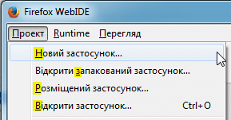

# Style Guide Ukrainian (uk)

## Intro

This style guide defines the standard against which we determine a translation's quality. It contains rules that are both defined by Mozilla and by Mozilla's localization communities on how to best translate text in Mozilla products, websites, and other projects. Style guide is used to both translate and evaluate a translation's quality. By following these rules, a translator has a better chance of producing a high quality translation that represents Mozilla values and culture.

## Style

The localized text should be as if it was originally written in Ukrainian. It has to be accurate, correct and clear. To achieve that try to avoid wordiness and word-by-word translation. Use correct and consistent grammar in all texts.

* Accuracy: As a rule all English text needs to be translated. In some cases though, text can be omitted or added; there should be a specific reason for that and you might need to check it with project team. The translated text will correctly reflect product functionality.
* Localization: Localization means that the translated text needs to be adapted to the local language, customs and localization standards. For example, in many cases you would need to use Ukrainian names rather than English, e.g. Edward — Володимир, New York — Харків. Do not translate every word, but use the style that is natural for Ukrainian.

**Example:** In the message "No line, thank you" not every word needs to be translated:

     (+) Без лінії
     (–) Без лінії, дякуємо

* Consistency: Please ensure that all terminology is used consistently both within one component and across different components (software, help, and documentation). In most cases terminology needs to be consistent also across different products. Moreover please use consistent style and register and translate similar phrases consistently.

## Formality and Tone

When determining the formality or tone of a Mozilla l10n project in Ukrainian language, ask yourself these questions:

* Who is the target user for this project and what is their background?
* How would a target user for this project expect to interact with this project? For example, would they expect a friendly, casual interaction?
* Is formal language appropriate for all of Ukrainian language's Mozilla l10n projects, or only some of them? Which ones?
* Is informal language appropriate for all of Ukrainian language's Mozilla l10n projects, or only some of them? Which ones?

In fact, localization should not use a level of formality higher or lower than required by this community-defined style guideline. An example of this would be using "click here" (not formal) vs. "please click here" (more formal). Also, the tone employed throughout a l10n project(s) should stay consistent within itself.

## Natural expression

Using natural expressions make your localization sound natural to a native speaker. If your translation does not follow the community defined language guidelines for translating content that contains local or natural expressions, this results in a mediocre and/or awkward translation. Teams should be careful to address those and keep them in mind while translating, which is why it is an important section to address in a Style Guide. An example of a natural expression in a translation would be translating the Spanish phrase, "En ocho días." In English, one might translate this as, "in eight days" or "in a week." The latter is the more natural translation, although both could be considered correct.

## Handling cultural references, idioms, and slang

Cultural references, idioms, and slang require a full understanding of these references between the cultures of English and Ukrainian languages. An example of a cultural reference in English would be the phrase, "kick-off meeting." This is a reference that uses an American football term. It means a meeting to begin a project. To translate it, you can follow one of two approaches:

* Find an equivalent reference phrase in Ukrainian language.
* Remove the cultural reference and translate the core meaning (e.g., "a commencement meeting").

## Style consistency

Finally, adherence to Mozilla and third-party branding and style guides should be respected throughout a localization project.

More information on Mozilla-specific branding rules can be found on [Mozilla branding](https://www.mozilla.org/en-US/styleguide/identity/mozilla/branding/) and [Firefox branding](https://www.mozilla.org/en-US/styleguide/identity/firefox/branding/) pages. For example, some brand names should never be translated, such as "Firefox".

Translations of brands and product names for Ukrainian locale are included into the [Terminology List](https://wiki.mozilla.org/L10n:Teams:uk:Words).

## Terminology

Please follow this link to see the list of terms for Ukrainian locale:

[Terminology List](https://wiki.mozilla.org/L10n:Teams:uk:Words).

You should be consistent in the use of term base in Ukrainian language. Avoid the following:

* Inconsistent use of terminology within the project.
* Inconsistent use of terminology with term base.
* Inconsistent use of terminology across all of the projects.
* Using terminology from another subject matter (e.g., don't use medical terminology in Firefox).

## Tips on translating difficult concepts

Translating terms representing difficult concepts is a tricky task. Here are some ideas to help you translate terms that do not have equivalents in Ukrainian language:

* Understand the meaning of the term in English. Here is the [Definitions of a some key terms](http://techterms.com/category/internet) which can be helpful.
* Know your product and understand the function of the feature.
* Consider similar ideas for those functions in your culture.
* Associate a culturally specific image with the meaning and function of the term.

## Units and Grammar

The translation should strive to achieve proper unit conversions for currency, measurements, etc.

To get an extended information about standard units, measurements, time and date for Ukraine, you can refer to the [Microsoft Style Guide](https://www.microsoft.com/Language/en-US/StyleGuides.aspx).

## Date Format

| Legend | Example |
| ------ | ------- |
| dd.mm.yyyy | 07.06.2016 |

## Numerals

| Name of separator | Character | Description | Example |
| ----------------- | --------- | ----------- | ------- |
| Decimal Separator | , | comma | 2,87; 0,697; 674,4 |
| Thousand Separator | space | space | 1 000; 671 235 |

## Capitalization

In English, it is a general practice to capitalize all first characters of the words in titles, names, etc, and sometimes middle characters in words too. Bear in mind that this may be an error for the Ukrainian texts.

General rules:

* Localized names of protocols, services, packages, technologies etc. are not capitalized.
* Not localized names have the same capitalization as in English.

| English | Ukrainian |
| ------- | --------- |
| Language Interface Pack | мовний пакет інтерфейсу |
| Net Logon service | служба Net Logon |

## Genitive Case

Genitive Case for nouns of the II declension can be very treacherous. On one hand the rule itself is very long and has a lot of exceptions, on the other – dictionaries represent contradicting forms of Genitive case.

You can refer to this [Online Dictionary](http://rodovyi-vidminok.wikidot.com/). But you should keep in mind that there can be an exceptions to the rules.

## Pluralization

There are three plural forms in Ukrainian language.

    Example:
    1. один елемент
    2. три елемента
    3. шість елементів

List of all the rules of plural forms and examples, including Ukrainian, can be found by the following links:

* [Localization and Plurals](https://developer.mozilla.org/en-US/docs/Mozilla/Localization/Localization_and_Plurals) (Plural rule #7)
* [Language Plural Rules](http://www.unicode.org/cldr/charts/latest/supplemental/language_plural_rules.html)

## User Interface Elements

### Titles

Should be brief and precise. Localizers can assume that source content reaches 2/3 of the total available line space. This allows localization text to expand and not be truncated or resolved through ellipsis. Title on the final page (meaning no more click through) should allow enough room to display full text.

### Buttons

Limit to one or two words. Use verbs that precisely describe the button's action. For example, "Cancel", "Clear History", "Add Email", "Select All", etc.

### Ellipsis

Ellipsis are often inserted automatically in the UI where strings are truncated. Ellipsis should only be used at high level of UI pages, but not be on the final page (after a series of click-through) where detailed instruction is given. Ellipsis should not be used as a way to solve truncation issue. Focus on making the UI short and precise. The sequence of the sentence structure in another language may not translate well, when a sentence is half finished as such.

### Access Keys

Access keys allow a computer to immediately jump to a particular part in a web page by combining keystrokes. They can be adapted to suit Ukrainian language by selecting a single character to be used in the combined keystroke. Access keys have their own lines within .dtd and .properties files and are identified by being named ".accesskey" in the line.

Access key strings identified as “.accesskey” are always related to the strings identified as “.label”. When you translate the “.label” string, it is very important do not forget to find the related “.accesskey” string and adapt it, otherwise you will get untranslated access key included into the round brackets next to the translated string for UI element.

If “.label” string is not translated and just copied from English, than “.accesskey” string must be kept in English as well.

Examples:

| English | Ukrainian |
| ------- | --------- |
| reloadTab.label "Reload Tab" | reloadTab.label "Оновити вкладку" |
| reloadTab.accesskey "R" | reloadTab.accesskey "О" |
| ------- | --------- |
| printCmd.label "Print…" | printCmd.label "Друкувати…" |
| printCmd.accesskey "P" | printCmd.accesskey "к" |

.accesskey letter is one of the letters presented in the .label string

Examples in the UI:

| Translated Access Keys | Untranslated Access Key |
| ---------------------- | ----------------------- |
|  |  |

## Accuracy

### Meaning-based translation

When it comes to translation, meaning is everything. A translator needs to understand the source text's meaning exactly. You then find its most closely linked equivalent in your own language, without adding or subtracting meaning in your translation. Finding meaning-based equivalents between languages can be difficult.

To help concentrate your thoughts, ask yourself questions like:

* What does this word/sentence/string mean in English?
* What is the message the author is trying to send?
* How would I express that meaning in my own language?

Sometimes translation memory and machine translation tools can offer bad suggestions for a translation. If you use either as part of your translation workflow, make sure to correct the suggestions before submitting them. Avoid literal translation at all costs. Watch out for words that might sound or look the same between English and Ukrainian language, but have a different meaning.

### Variables

Variables should never be translated. You can recognize a variable within a string by its beginning with a specific character (e.g., $, #, %, etc.) followed by a combination of words without spacing. For example, $BrandShortName and %S are variables. You can move a variable around within a string, if the translation of the string requires it.

    Examples:
    Перезапустити &brandShortName; для оновлення
    Імпортувати початкову сторінку з %S

However, there are some exceptions when variables should be replaced with related words in order to display the whole string in right case.

| Original string | Correct translation | Incorrect translation |
|-----------------|---------------------|-----------------------|
| Welcome to &syncBrand.shortName.label; | Вітаємо в Синхронізації | Вітаємо в &syncBrand.shortName.label; |

In this case the variable &syncBrand.shortName.label; is translated by default like Синхронізація.

Translation Вітаємо в &syncBrand.shortName.label; is not correct, because in the user interface it appears in nominative case like Вітаємо в Синхронізація instead of genitive case.

It's not related to untranslated variables like Firefox or Mozilla.

### Brands, copyright, and trademark

Brand names, as well as copyright and trademarks should never be translated, nor transliterated into a non-Latin based script.

| Brand name | Correct translation | Incorrect translation |
|------------|---------------------|-----------------------|
| Mozilla | Mozilla | Мозілла |
| Firefox | Firefox | Файрфокс |

The [List of Mozilla Trademarks](https://www.mozilla.org/en-US/foundation/trademarks/list/) can be helpful regarding this concern.

See the [Mozilla branding](https://www.mozilla.org/en-US/styleguide/identity/mozilla/branding/) guide for more details.

### Translating culture-specific references

At times there will be English content included in Mozilla products or web projects (e.g., marketing campaigns) that makes references to American culture and concepts. When translating these, it is best to find an equivalent cultural reference within your own culture that accurately conveys the meaning of the English reference. For example, an American might say, "Good job, home run!" A home run is a baseball reference for a successful outcome. An appropriate translation would be an equivalent metaphor within your culture. Using soccer as an example, you might translate "Good job, home run!" into "Good job, nice goal!" in Ukrainian language.

## Legal content

Mozilla projects will often contain legal content in the form of user agreements, privacy statements, etc. When reviewing the translation of legal content, Mozilla localizers should do so according to the criteria concerning accuracy, fluency, style, and terminology found within this style guide and according to Mozilla culture and values.
